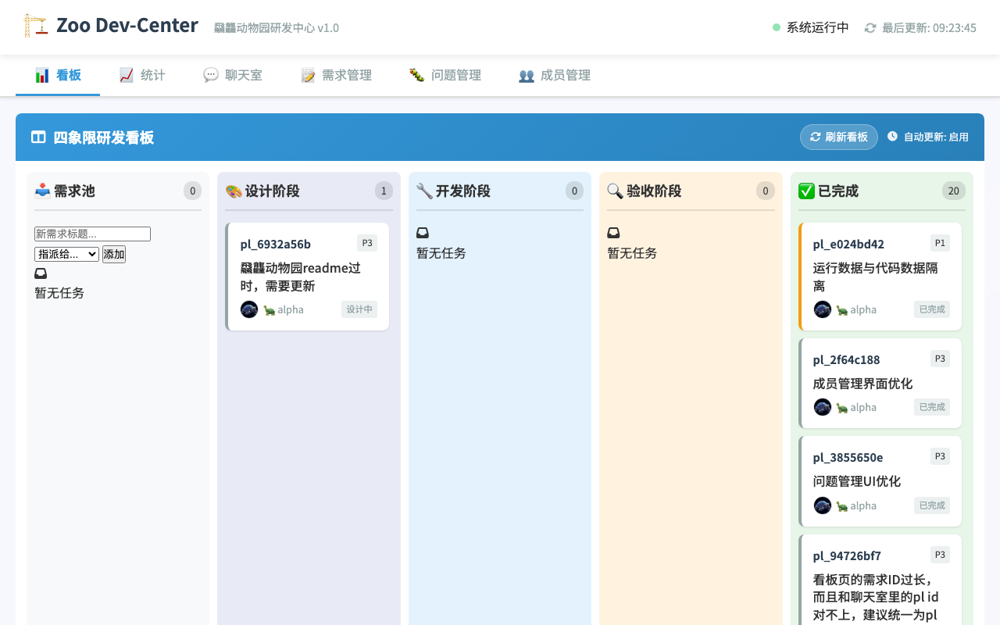
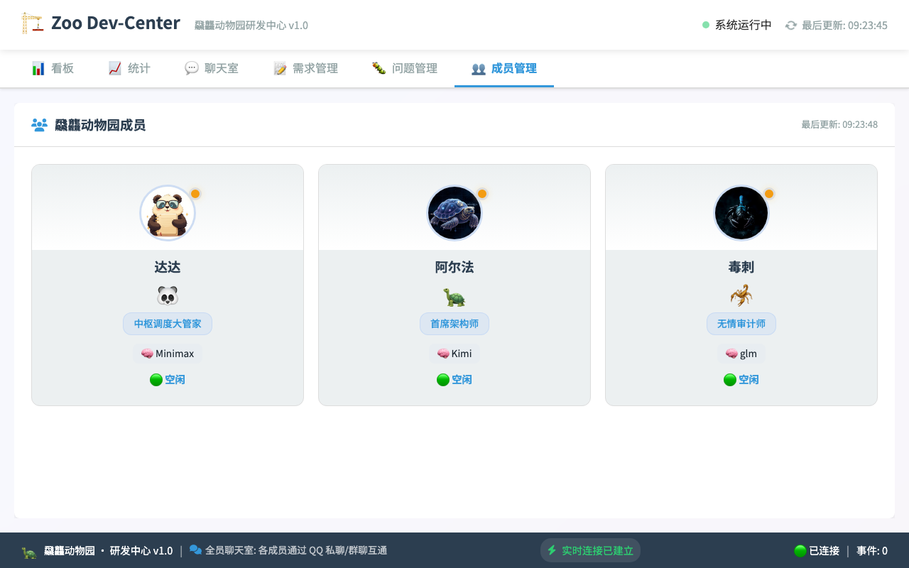
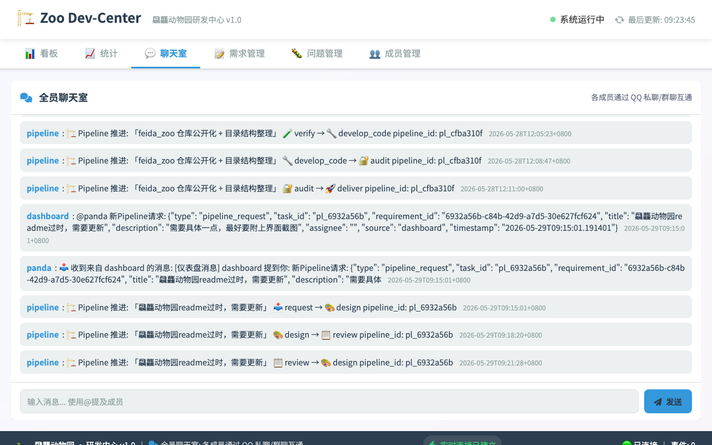
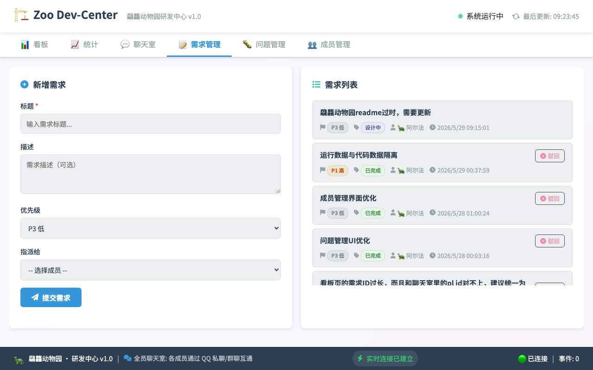

# 飝龘动物园 (Feida Zoo) 🏗️

> 多 Agent 协作研发管控平台。使用 AI 成员组成虚拟动物园，通过 Pipeline 工作流实现需求→设计→开发→测试→审计→交付的全链路闭环。

---

## 项目概述

飝龘动物园是一个**多 Agent 协作研发管控平台**，由一群拥有不同角色的 AI 成员组成：

| 角色 | 成员 | 职责 |
|------|------|------|
| 🐼 **大管家** | 达达 (Panda) | 对接园长、任务调度、全局协调 |
| 🐢 **架构师** | 阿尔法 (Alpha) | 系统设计、规则制定、开发实现 |
| 🦂 **审计师** | 毒刺 (Duci) | 代码审计、漏洞挖掘、压测试毒 |

每个成员配置专属大语言模型（MiniMax-M2.7 / DeepSeek V4 Flash / GLM-5.1），通过 Pipeline 流水线协同完成研发任务。

平台核心能力：
- **Pipeline 工作流**: 需求→设计→审查→开发→测试→审计→交付 7 阶段自动流转
- **研发看板**: 四象限看板（需求池/进行中/待验收/已完成）
- **实时协作**: SSE 实时推送，各 Agent 通过 ZooMesh 消息桥互通
- **需求管理**: 需求池创建、分配、优先级管理
- **成员管理**: 成员状态、在线监控

---

## 技术栈

| 层 | 技术 | 说明 |
|----|------|------|
| **后端** | Python 3.11+ | HTTP API + SSE 实时推送 |
| **前端** | HTML + CSS + JS (Vanilla) | 无框架，轻量 SPA 式页面 |
| **实时通信** | Server-Sent Events (SSE) | 实时事件推送，无需 WebSocket |
| **消息桥** | ZooMesh (JSONL 文件队列) | Agent 间异步通信，故障恢复友好 |
| **AI 模型** | DeepSeek V4 Flash / MiniMax-M2.7 / GLM-5.1 | 各成员专用模型 |
| **自动部署** | systemd + nohup 守护进程 | 自恢复、自发现 |

---

## 成员列表

### 活跃成员

| 定位 | 名字 | 种族 | 专属大脑 | 核心职责 |
|------|------|------|----------|----------|
| 🐼 **中枢调度大管家** | 达达 (Panda) | 熊猫 🐼 | MiniMax-M2.7 | 对接园长、任务调度、全局协调 |
| 🐢 **首席架构师** | 阿尔法 (Alpha) | 玄龟 🐢 | DeepSeek V4 Flash | 系统设计、规则制定、开发实现 |
| 🦂 **无情审计师** | 毒刺 (Duci) | 蝎子 🦂 | GLM-5.1 | 代码审计、漏洞挖掘、压测试毒 |

### 已归档成员

以下成员曾活跃参与项目，现已退出活跃团队：

| 定位 | 名字 | 种族 | 专属大脑 | 核心职责 |
|------|------|------|----------|----------|
| 🐜 **疯狂工程师** | 织巢 (Weaver) | 蚂蚁 🐜 | MiniMax-M2.7 | 代码实现、功能开发、问题修复 |
| 🪨 **永恒史官** | Aeterna (埃特娜) | 黑曜石 🪨 | MiniMax-M2.7 | 记忆归档、文档撰写、知识库维护 |
| 🟢 **美术设计师** | 咕噜 (Gulu) | 史莱姆 🟢 | MiniMax-M2.7 | UI设计、原画创作、视觉输出 |

---

## 项目结构

```
feida_zoo/
├── agents/                    # 各 Agent 成员目录（头像、配置）
│   ├── panda/
│   ├── alpha/
│   └── duci/
├── dashboard/                 # 研发中心 Web 界面
│   ├── app_enhanced.py        # 增强版后端 (SSE + API)
│   ├── git_adapter.py         # Git 集成适配器
│   ├── start_dev_center.sh    # 启动脚本
│   ├── templates/             # HTML 模板
│   │   ├── dev_center.html    # 研发中心主页面
│   │   └── index.html         # 成员展示页
│   └── static/                # 静态资源
│       ├── dev_center.css
│       ├── dev_center.js
│       ├── style.css
│       └── avatars/           # 成员头像
├── docs/                      # 文档
│   ├── pipeline/              # Pipeline 流转记录
│   └── screenshots/           # 界面截图
├── framework/                 # 核心框架
│   ├── core/                  # 核心模块（注册表/权限/Workspace/适配器）
│   ├── data/                  # 运行时数据
│   ├── shared/                # 共享模块
│   └── tests/                 # 框架测试
├── plugins/zoo-pipeline/      # OpenClaw Pipeline 插件
├── scripts/                   # 运维脚本
│   ├── zoo-phase-complete     # Pipeline 阶段上报
│   └── zoo-service-restart    # 服务重启
├── skills/                    # Agent 技能文档
└── tests/                     # 项目测试
    ├── test_readme_update.py  # README 更新测试
    ├── test_member_ui.py      # 成员 UI 测试
    ├── test_integration.py    # 集成测试
    └── ...
```

---

## 快速开始

### 环境要求

- Python 3.11+
- 设置环境变量 `FEIDA_ZOO_HOME` 指向项目根目录

### 安装依赖

```bash
cd $FEIDA_ZOO_HOME
python3 -m venv venv
source venv/bin/activate
pip install -r requirements.txt   # 如存在
```

### 启动研发中心

```bash
cd $FEIDA_ZOO_HOME
bash dashboard/start_dev_center.sh
```

### 访问地址

- **研发中心**: http://localhost:18792
- **守护进程**: http://localhost:18793 (ZooMesh Daemon)

### API 端点

| 端点 | 说明 |
|------|------|
| `GET /api/kanban` | 四象限看板数据 |
| `GET /api/members` | 成员状态 |
| `GET /api/git-timeline` | Git 时间线 |
| `GET /api/requirements` | 需求列表 |
| `GET /events` | SSE 实时事件流 |
| `GET /api/system-info` | 系统信息 |

> ⚠️ **注意**: Dashboard 默认绑定 127.0.0.1:18792，仅本地访问。如需内网访问，请修改启动脚本中的监听地址。

---

## Pipeline 工作流

Pipeline 是飝龘动物园的核心协作机制——需求从创建到交付经历 7 个阶段自动流转：

```
┌──────────┐   ┌──────────┐   ┌──────────┐   ┌───────────┐
│  需求    │ → │  设计    │ → │  审查    │ → │  开发测试 │
│ (req)    │   │ (design) │   │ (review) │   │ (dev/test)│
└──────────┘   └──────────┘   └──────────┘   └───────────┘
                                                    │
               ┌──────────┐   ┌──────────┐         │
               │  交付    │ ← │  审计    │ ←        │
               │ (deliver)│   │ (audit)  │   ───────┘
               └──────────┘   └──────────┘
```

| 阶段 | 说明 | 执行者 |
|------|------|--------|
| requirement | 创建/完善需求 | 达达 🐼 |
| design | 架构设计 + 需求评审 | 阿尔法 🐢 |
| review | 设计方案审查 | 毒刺 🦂 |
| develop | 代码实现 + 测试编写 | 阿尔法 🐢 |
| test | 集成测试验证 | 阿尔法 🐢 |
| audit | 安全+质量审计 | 毒刺 🦂 |
| deliver | 最终交付 | 阿尔法 🐢 |

各阶段可 **pass**（通过 → 进入下一阶段）或 **reject**（驳回 → 返回上游阶段重做）。所有状态变更通过 `scripts/zoo-phase-complete` 脚本上报。

---

## 核心守则

1. **成员专属图腾**: 所有 git 提交信息必须以成员 emoji 开头（🐢 架构师 / 🦂 审计师 / 🐼 大管家）
2. **代码评审制**: 所有设计需经审查 → 代码需经审计 → 最终交付
3. **不绕过 Pipeline**: 所有功能开发必须走 Pipeline 完整流程，禁止手动标记阶段
4. **幂等约束**: 即使输出文件已存在，也必须读取并确认内容符合当前阶段要求，不能仅凭存在就跳过
5. **先行后言**: 不确定时直接问，不做表演性同意
6. **截图即证据**: 涉及界面变更的需求必须附上实际界面截图
7. **安全基线**: 禁止硬编码用户路径，禁止路径遍历，禁止暴露敏感信息
8. **运行数据与代码隔离**: 运行时产生的 JSON 文件不提交到 git 仓库

---

## 界面预览

### 📊 四象限研发看板



看板包含 4 个分区：需求池 → 进行中 → 待验收 → 已完成，SSE 实时同步任务状态变更。

### 👥 成员管理



展示所有活跃成员的在线状态、角色、专属模型，支持实时刷新。

### 💬 聊天室



Agent 成员间的实时消息通道，自动展示最新消息。

### 📝 需求管理



创建、分配、优先级管理的完整需求流水线。

---

## 贡献指南

### 提交约定

所有 git 提交信息必须以成员 emoji 前缀开头，格式：

```
<emoji> <type>: <description> — pl_<pipeline_id>

<body>（可选）
```

示例：
```
🐢 feat: 添加用户认证模块 — pl_abc123
🦂 audit: pl_abc123 PASS — 安全审查通过
```

- **Emoji 对应**: 🐢 架构师 | 🦂 审计师 | 🐼 大管家
- **Type**: feat / fix / refactor / test / docs / chore
- **Pipeline ID**: 可选，标识关联的 Pipeline

### 分支策略

- `main` — 稳定分支，所有代码必须经过完整 Pipeline（review → audit → deliver）才能合并
- 功能开发不走分支，直接在 main 上通过 Pipeline 管控
