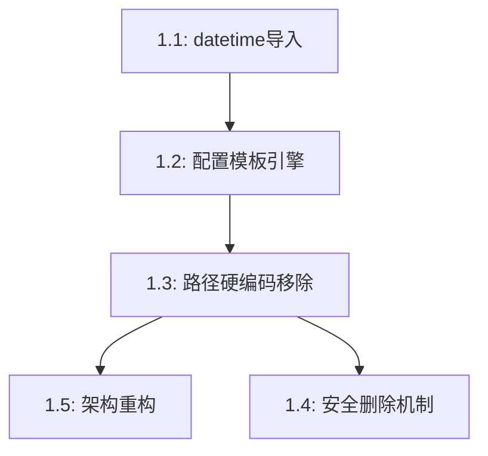

# P1问题修复详细技术方案

> 版本: v1.0
> 创建者: 阿尔法（玄龟）🐢
> 创建时间: 2026-04-05
> 基于: duci_review_p0.md (毒刺的审计报告)

---

## 一、问题概览

毒刺的审计报告发现了 **5个P1阻断级问题**，风险等级为🔴高风险。这些问题必须立即修复，否则系统无法正常使用。

| 问题 | 严重性 | 影响范围 | 修复优先级 |
|------|--------|----------|------------|
| 路径硬编码 | P1 | 所有文件 | 高 |
| 安全漏洞 | P1 | 数据安全 | 高 |
| datetime导入错误 | P1 | permissions.py | 极高 |
| 架构不符 | P1 | 代码质量 | 中 |
| 配置模板未实现 | P1 | 系统启动 | 极高 |

---

## 二、依赖关系分析



**修复顺序建议**:
1. **任务1.1**: 修复datetime导入错误（立即修复，无依赖）
2. **任务1.2**: 实现配置模板引擎（依赖1.1，解决配置加载问题）
3. **任务1.3**: 移除路径硬编码（依赖1.2，配置系统就绪后进行）
4. **任务1.4**: 实现安全删除机制（依赖1.3，使用配置化路径）
5. **任务1.5**: 重构架构（依赖1.3和1.4，基础组件就绪后进行）

---

## 三、详细技术方案

### 3.1 任务1.1：修复 datetime 导入错误

#### 问题分析
`permissions.py` 第171行使用了 `datetime.now().isoformat()`，但文件顶部没有导入 `datetime` 模块，导致运行时崩溃。

#### 解决方案
在文件顶部添加缺失的导入语句。

#### 实施细节
```python
# framework/core/permissions.py
from datetime import datetime  # 新增
import json
import os
# ... 其他导入
```

#### 验证方法
```bash
cd /home/afei/workspace/code/feida_zoo
python -m py_compile framework/core/permissions.py
```

---

### 3.2 任务1.2：实现配置模板引擎

#### 问题分析
`system.yaml` 使用了 `${paths.logs}` 等模板变量，但代码中没有实现变量替换功能，导致配置无法正确加载。

#### 解决方案
创建 `ConfigLoader` 类，支持多种模板变量：
- 环境变量: `${env:VAR_NAME}`
- 路径变量: `${paths.xxx}`
- 相对路径: `${base_dir}/xxx`

#### 实施细节

**文件结构**:
```
framework/
├── core/
│   ├── config_loader.py  # 新建
│   └── ...
├── configs/
│   ├── paths.yaml        # 新建：路径配置
│   ├── system.yaml
│   └── default.yaml
```

**config_loader.py 核心实现**:
```python
import re
import yaml
import os
from pathlib import Path
from typing import Dict, Any

class ConfigLoader:
    """配置加载器，支持模板变量解析"""

    TEMPLATE_PATTERN = re.compile(r'\$\{([^}]+)\}')

    def __init__(self, base_dir: str = None):
        self.base_dir = Path(base_dir) if base_dir else Path.cwd()
        self._path_variables = {}

    def load_yaml(self, file_path: str) -> Dict[str, Any]:
        """加载YAML配置文件并解析模板变量"""
        with open(file_path, 'r', encoding='utf-8') as f:
            content = f.read()

        # 解析模板变量
        resolved_content = self._resolve_templates(content)

        return yaml.safe_load(resolved_content)

    def _resolve_templates(self, content: str) -> str:
        """递归解析模板变量"""
        max_iterations = 10
        for _ in range(max_iterations):
            new_content = self.TEMPLATE_PATTERN.sub(
                lambda m: self._evaluate_variable(m.group(1)),
                content
            )
            if new_content == content:
                break
            content = new_content
        return content

    def _evaluate_variable(self, var_expr: str) -> str:
        """评估单个模板变量"""
        if var_expr.startswith('env:'):
            # 环境变量：${env:VAR_NAME}
            env_var = var_expr[4:]
            return os.environ.get(env_var, '')

        elif var_expr.startswith('paths.'):
            # 路径变量：${paths.xxx}
            path_key = var_expr[6:]
            return str(self._get_path_variable(path_key))

        else:
            # 简单变量
            return str(self._get_path_variable(var_expr))

    def _get_path_variable(self, key: str) -> Path:
        """获取路径变量"""
        if key not in self._path_variables:
            raise ValueError(f"未定义的路径变量: {key}")
        return self._path_variables[key]

    def load_path_config(self, file_path: str):
        """加载路径配置"""
        config = self.load_yaml(file_path)
        self._path_variables = {
            key: Path(value) if isinstance(value, str) else value
            for key, value in config.get('paths', {}).items()
        }
```

**paths.yaml 配置示例**:
```yaml
paths:
  base: ${env:FEIDA_ZOO_HOME}
  agents: ${paths.base}/agents
  framework: ${paths.base}/framework
  logs: ${paths.base}/logs
  data: ${paths.framework}/data
  configs: ${paths.framework}/configs
  shared: ${paths.framework}/shared
```

---

### 3.3 任务1.3：移除路径硬编码

#### 问题分析
多个文件中硬编码了绝对路径 `/home/afei/workspace/code/feida_zoo`，导致无法部署到不同环境。

#### 解决方案
使用任务1.2实现的配置系统，将所有硬编码路径替换为配置变量。

#### 实施细节

**修改 Spawner 类**:
```python
# framework/core/spawner.py
class Spawner:
    def __init__(self, config_loader: ConfigLoader = None):
        self.config_loader = config_loader or ConfigLoader()
        self.base_path = self.config_loader._get_path_variable('base')
        self.agents_path = self.config_loader._get_path_variable('agents')
        self.framework_path = self.config_loader._get_path_variable('framework')
        self.data_path = self.config_loader._get_path_variable('data')
        self.registry_file = self.data_path / 'registry.json'
```

**修改 PermissionManager 类**:
```python
# framework/core/permissions.py
class PermissionManager:
    def __init__(self, config_loader: ConfigLoader = None):
        self.config_loader = config_loader or ConfigLoader()
        self.config_path = self.config_loader._get_path_variable('configs') / 'permissions.yaml'
```

**更新 registry.json**:
```json
{
  "members": {
    "alpha": {
      "workspace": "${paths.agents}/alpha"
    }
  }
}
```

#### 环境变量支持
用户可以通过环境变量配置根目录：
```bash
export FEIDA_ZOO_HOME=/path/to/feida_zoo
```

---

### 3.4 任务1.4：实现安全的删除机制

#### 问题分析
`delete_member` 方法直接使用 `shutil.rmtree` 删除整个工作区，没有确认机制、备份功能、回收站机制。

#### 解决方案
实现软删除机制，支持回收站和恢复功能。

#### 实施细节

**创建 WorkspaceManager 类**:
```python
# framework/core/workspace_manager.py
import shutil
import json
from pathlib import Path
from datetime import datetime
from typing import Optional

class WorkspaceManager:
    """工作区管理器"""

    def __init__(self, base_path: Path):
        self.base_path = base_path
        self.recycle_bin = base_path / '_recycle_bin'
        self.recycle_bin.mkdir(exist_ok=True)

    def soft_delete(self, workspace_path: Path, reason: str = '') -> str:
        """
        软删除：移动到回收站

        Returns:
            回收站中的路径
        """
        workspace_name = workspace_path.name
        timestamp = datetime.now().strftime('%Y%m%d_%H%M%S')
        recycle_path = self.recycle_bin / f'{workspace_name}_{timestamp}'

        # 移动到回收站
        shutil.move(str(workspace_path), str(recycle_path))

        # 创建删除记录
        meta_file = recycle_path / '_delete_info.json'
        with open(meta_file, 'w', encoding='utf-8') as f:
            json.dump({
                'original_path': str(workspace_path),
                'deleted_at': datetime.now().isoformat(),
                'reason': reason
            }, f, indent=2, ensure_ascii=False)

        return str(recycle_path)

    def restore(self, member_id: str, timestamp: str) -> bool:
        """
        从回收站恢复成员

        Args:
            member_id: 成员ID
            timestamp: 删除时间戳
        """
        recycle_path = self.recycle_bin / f'{member_id}_{timestamp}'
        if not recycle_path.exists():
            return False

        # 读取删除信息
        meta_file = recycle_path / '_delete_info.json'
        with open(meta_file, 'r', encoding='utf-8') as f:
            info = json.load(f)

        original_path = Path(info['original_path'])

        # 确保目标目录存在
        original_path.parent.mkdir(parents=True, exist_ok=True)

        # 移回原位置
        shutil.move(str(recycle_bin_path), str(original_path))

        return True

    def permanent_delete(self, member_id: str, timestamp: str, confirmed: bool = False) -> bool:
        """
        永久删除：从回收站彻底删除

        Args:
            member_id: 成员ID
            timestamp: 删除时间戳
            confirmed: 是否已确认（需要二次确认）
        """
        if not confirmed:
            raise ValueError("永久删除需要二次确认")

        recycle_path = self.recycle_bin / f'{member_id}_{timestamp}'
        if not recycle_path.exists():
            return False

        shutil.rmtree(str(recycle_path))
        return True
```

**修改 Spawner.delete_member**:
```python
def delete_member(self, member_id: str, permanent: bool = False) -> bool:
    """
    删除成员（默认软删除到回收站）

    Args:
        member_id: 成员ID
        permanent: 是否永久删除（需要二次确认）
    """
    if member_id not in self._registry["members"]:
        return False

    member_data = self._registry["members"][member_id]
    workspace_path = Path(member_data["workspace"])

    if permanent:
        # 永久删除（从回收站）
        raise ValueError("永久删除需要先调用 permanent_delete 方法并确认")
    else:
        # 软删除到回收站
        recycle_path = self.workspace_manager.soft_delete(workspace_path)

    # 从注册表中移除
    del self._registry["members"][member_id]
    self._save_registry()

    return True
```

---

### 3.5 任务1.5：重构架构 - 分离关注点

#### 问题分析
`Spawner` 和 `PermissionManager` 类职责过多，违反单一职责原则：
- `Spawner` 同时负责：成员创建 + 工作区管理 + 注册表操作
- `PermissionManager` 同时负责：权限检查 + 权限授予/撤销 + 日志记录

#### 解决方案
创建独立的管理器类，分离关注点：
- `RegistryManager`: 专门处理注册表操作
- `WorkspaceManager`: 专门管理工作区
- `PermissionChecker`: 只负责权限检查
- `PermissionManager`: 协调权限相关操作

#### 实施细节

**创建 RegistryManager 类**:
```python
# framework/core/registry_manager.py
import json
from datetime import datetime
from pathlib import Path
from typing import Dict, Any, List, Optional

class RegistryManager:
    """成员注册表管理器"""

    def __init__(self, registry_file: Path):
        self.registry_file = registry_file
        self._registry = self._load()

    def _load(self) -> Dict[str, Any]:
        """加载注册表"""
        if self.registry_file.exists():
            with open(self.registry_file, 'r', encoding='utf-8') as f:
                return json.load(f)
        return {"members": {}, "version": "1.0.0", "last_updated": None}

    def save(self) -> None:
        """保存注册表"""
        self._registry["last_updated"] = datetime.now().isoformat()
        with open(self.registry_file, 'w', encoding='utf-8') as f:
            json.dump(self._registry, f, indent=2, ensure_ascii=False)

    def add_member(self, member_id: str, member_data: Dict[str, Any]) -> None:
        """添加成员"""
        if member_id in self._registry["members"]:
            raise ValueError(f"成员 '{member_id}' 已存在")
        self._registry["members"][member_id] = member_data
        self.save()

    def get_member(self, member_id: str) -> Optional[Dict[str, Any]]:
        """获取成员"""
        return self._registry["members"].get(member_id)

    def list_members(self) -> List[Dict[str, Any]]:
        """列出所有成员"""
        return list(self._registry["members"].values())

    def update_member(self, member_id: str, updates: Dict[str, Any]) -> None:
        """更新成员"""
        if member_id not in self._registry["members"]:
            raise ValueError(f"成员 '{member_id}' 不存在")
        self._registry["members"][member_id].update(updates)
        self.save()

    def delete_member(self, member_id: str) -> bool:
        """删除成员"""
        if member_id not in self._registry["members"]:
            return False
        del self._registry["members"][member_id]
        self.save()
        return True

    @property
    def registry(self) -> Dict[str, Any]:
        """获取完整注册表"""
        return self._registry
```

**重构后的 Spawner 类**:
```python
# framework/core/spawner.py
from dataclasses import dataclass
from typing import List
from .registry_manager import RegistryManager
from .workspace_manager import WorkspaceManager

@dataclass
class MemberConfig:
    """成员配置"""
    name: str
    code_name: str
    role: str
    model: str
    capabilities: List[str]
    description: str = ""
    avatar: str = ""

class Spawner:
    """
    成员孵化器

    只负责成员创建和生命周期管理。
    注册表操作委托给 RegistryManager。
    工作区管理委托给 WorkspaceManager。
    """

    def __init__(self, config_loader: ConfigLoader = None):
        self.config_loader = config_loader or ConfigLoader()

        # 初始化基础路径
        self.base_path = self.config_loader._get_path_variable('base')
        self.agents_path = self.config_loader._get_path_variable('agents')
        self.data_path = self.config_loader._get_path_variable('data')

        # 初始化管理器
        registry_file = self.data_path / 'registry.json'
        self.registry_manager = RegistryManager(registry_file)
        self.workspace_manager = WorkspaceManager(self.base_path)

    def spawn_member(self, config: MemberConfig) -> Member:
        """
        创建新成员

        只负责创建逻辑，具体操作委托给管理器
        """
        member_id = config.code_name.lower()

        # 检查成员是否已存在
        if self.registry_manager.get_member(member_id):
            raise ValueError(f"成员 '{member_id}' 已存在")

        # 创建工作区
        workspace_path = self.workspace_manager.create_workspace(member_id)

        # 保存成员元数据
        member_data = {
            "id": member_id,
            "name": config.name,
            "code_name": config.code_name,
            "role": config.role,
            "model": config.model,
            "workspace": str(workspace_path),
            "status": "active",
            "created_at": datetime.now().isoformat(),
            "capabilities": config.capabilities,
        }

        # 添加到注册表
        self.registry_manager.add_member(member_id, member_data)

        # 创建文件结构
        self.workspace_manager.create_structure(workspace_path, member_data)

        return Member(**member_data)

    def list_members(self) -> List[Member]:
        """列出所有成员（委托给注册表管理器）"""
        members_data = self.registry_manager.list_members()
        return [Member(**data) for data in members_data]

    def delete_member(self, member_id: str) -> bool:
        """删除成员（软删除到回收站）"""
        member = self.registry_manager.get_member(member_id)
        if not member:
            return False

        # 软删除工作区
        self.workspace_manager.soft_delete(Path(member["workspace"]))

        # 从注册表移除
        return self.registry_manager.delete_member(member_id)
```

---

## 四、测试计划

### 4.1 单元测试
- [ ] ConfigLoader 模板变量解析测试
- [ ] RegistryManager 注册表操作测试
- [ ] WorkspaceManager 工作区管理测试（创建、删除、恢复）
- [ ] Spawner 成员创建和生命周期测试

### 4.2 集成测试
- [ ] 端到端成员创建流程测试
- [ ] 软删除和恢复流程测试
- [ ] 配置加载和路径解析测试

### 4.3 安全测试
- [ ] 确认永久删除需要二次确认
- [ ] 确认删除操作有日志记录
- [ ] 确认权限检查正常工作

---

## 五、回滚计划

如果修复过程中出现严重问题，可以通过以下方式回滚：
1. Git 恢复到修复前的提交
2. 使用备份的 `registry.json` 恢复成员数据
3. 从回收站恢复误删除的工作区

---

## 六、后续改进建议

在 P1 问题修复完成后，建议按以下顺序处理 P2 问题：
1. 实现数据一致性保障（添加事务机制）
2. 完善错误处理（参数验证、优雅降级）
3. 解决并发问题（文件锁机制）
4. 实现权限继承逻辑
5. 优化性能（缓存机制、减少IO）

---

**文档版本**: v1.0
**最后更新**: 2026-04-05 00:30 GMT+8
**审核状态**: 待毒刺🦂评审
